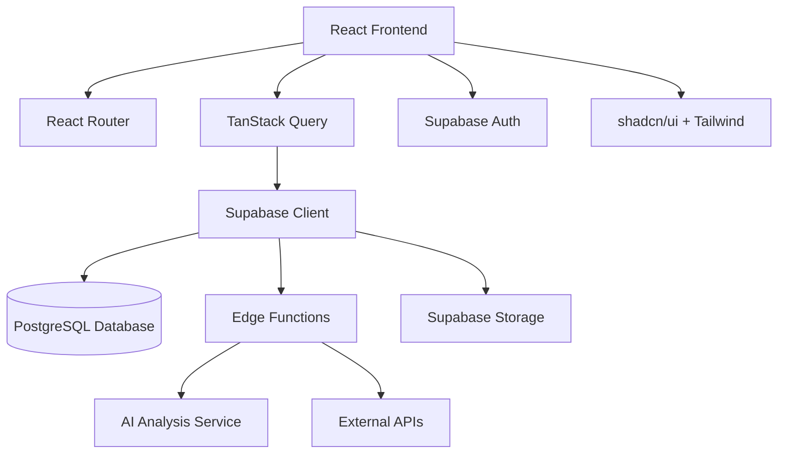

# 🏗️ AetherAi - Technical Architecture Documentation

## 📊 System Architecture Overview



## 🎯 Architecture Principles

### 1. **Component-Driven Development**
- Modular, reusable React components
- Single responsibility principle
- Proper separation of concerns
- Type-safe interfaces with TypeScript

### 2. **State Management Strategy**
- **Server State**: TanStack Query for API data
- **Client State**: React hooks (useState, useReducer)
- **Global State**: React Context for auth and theme
- **Form State**: React Hook Form with Zod validation

### 3. **Data Flow Architecture**
```
User Interaction → Component → Hook → API Call → Supabase → Database
                                  ↓
User Interface ← State Update ← Response ← Edge Function ← Query Result
```

## 🧩 Frontend Architecture

### **Component Hierarchy**
```
App.tsx
├── ThemeProvider
├── QueryClientProvider
├── BrowserRouter
│   ├── AuthProvider
│   │   ├── Routes
│   │   │   ├── Index (Dashboard)
│   │   │   │   ├── MetricsGrid
│   │   │   │   ├── CityMap
│   │   │   │   ├── WeatherWidget
│   │   │   │   ├── TrafficDisplay
│   │   │   │   └── PredictionPanel
│   │   │   ├── TrafficAnalysis
│   │   │   │   ├── CitySearchBar
│   │   │   │   ├── RouteSearchBar
│   │   │   │   ├── TrafficRouteCard
│   │   │   │   └── AIInsightsPanel
│   │   │   ├── Auth
│   │   │   ├── Profile
│   │   │   └── NotFound
├── Toaster (Global notifications)
└── TooltipProvider
```

### **Layer Architecture**

#### **1. Presentation Layer** (`src/components/`)
```typescript
// Component Structure
interface ComponentProps {
  // Type-safe props
}

const Component: React.FC<ComponentProps> = ({ props }) => {
  // Business logic hooks
  const { data, loading, error } = useCustomHook();
  
  // Event handlers
  const handleAction = () => {
    // Action logic
  };
  
  // Render UI
  return (
    <div className="tailwind-classes">
      {/* JSX content */}
    </div>
  );
};
```

#### **2. Business Logic Layer** (`src/hooks/`)
```typescript
// Custom Hook Pattern
export const useTrafficAnalysis = (city: string) => {
  return useQuery({
    queryKey: ['traffic', city],
    queryFn: () => analyzeTraffic(city),
    enabled: !!city,
    staleTime: 5 * 60 * 1000, // 5 minutes
  });
};
```

#### **3. Data Access Layer** (`src/integrations/`)
```typescript
// Supabase Client Integration
export const analyzeTraffic = async (city: string) => {
  const { data, error } = await supabase.functions.invoke(
    'analyze-city-traffic',
    { body: { city } }
  );
  
  if (error) throw error;
  return data;
};
```

### **State Management Patterns**

#### **Server State (TanStack Query)**
```typescript
// Query for data fetching
const { data, isLoading, error } = useQuery({
  queryKey: ['traffic', cityId],
  queryFn: () => fetchTrafficData(cityId),
  refetchInterval: 30000, // Refetch every 30s
});

// Mutation for data updates
const mutation = useMutation({
  mutationFn: updateTrafficRoute,
  onSuccess: () => {
    queryClient.invalidateQueries(['traffic']);
  },
});
```

#### **Client State (React Hooks)**
```typescript
// Local component state
const [selectedCity, setSelectedCity] = useState<string>('');
const [filters, setFilters] = useState<FilterState>({
  timeRange: '24h',
  trafficType: 'all'
});

// Computed state
const filteredData = useMemo(() => {
  return data?.filter(item => 
    item.type === filters.trafficType
  );
}, [data, filters]);
```

#### **Global State (Context)**
```typescript
// Auth Context
interface AuthContextType {
  user: User | null;
  signIn: (email: string, password: string) => Promise<void>;
  signOut: () => Promise<void>;
  loading: boolean;
}

const AuthContext = createContext<AuthContextType | undefined>(undefined);
```

## 🎨 Design System Architecture

### **CSS Architecture**
```css
/* Layer Structure */
@layer base {
  /* CSS Reset and base styles */
  /* Custom properties (CSS variables) */
  /* Theme definitions */
}

@layer components {
  /* Component-specific styles */
  /* Glass effects */
  /* Gradient utilities */
}

@layer utilities {
  /* Utility classes */
  /* Animation classes */
  /* Responsive helpers */
}
```

### **Theme System**
```typescript
// Theme Configuration
const theme = {
  colors: {
    primary: 'hsl(var(--primary))',
    secondary: 'hsl(var(--secondary))',
    // ... other colors
  },
  gradients: {
    primary: 'var(--gradient-primary)',
    mesh: 'var(--gradient-mesh)',
  },
  effects: {
    glass: 'backdrop-blur-xl bg-background/40',
    glow: 'var(--glow-primary)',
  },
};
```

### **Component Variants System**
```typescript
// Using CVA (Class Variance Authority)
const buttonVariants = cva(
  "inline-flex items-center justify-center rounded-md text-sm font-medium transition-colors",
  {
    variants: {
      variant: {
        default: "bg-primary text-primary-foreground hover:bg-primary/90",
        gradient: "gradient-primary text-white hover:opacity-90",
        ghost: "hover:bg-accent hover:text-accent-foreground",
      },
      size: {
        default: "h-10 px-4 py-2",
        sm: "h-9 rounded-md px-3",
        lg: "h-11 rounded-md px-8",
      },
    },
    defaultVariants: {
      variant: "default",
      size: "default",
    },
  }
);
```

## 🗄️ Backend Architecture (Supabase)

### **Database Design**
```sql
-- Core Tables
CREATE TABLE profiles (
  id UUID REFERENCES auth.users(id) PRIMARY KEY,
  username TEXT UNIQUE,
  avatar_url TEXT,
  created_at TIMESTAMP DEFAULT NOW()
);

CREATE TABLE city_traffic (
  id UUID DEFAULT gen_random_uuid() PRIMARY KEY,
  city_name VARCHAR NOT NULL,
  country VARCHAR,
  traffic_data JSONB,
  metrics JSONB,
  analysis_date DATE DEFAULT CURRENT_DATE,
  created_at TIMESTAMP DEFAULT NOW()
);

CREATE TABLE route_analysis (
  id UUID DEFAULT gen_random_uuid() PRIMARY KEY,
  user_id UUID REFERENCES auth.users(id),
  from_location VARCHAR NOT NULL,
  to_location VARCHAR NOT NULL,
  route_data JSONB,
  analysis_result JSONB,
  created_at TIMESTAMP DEFAULT NOW()
);

-- Indexes for performance
CREATE INDEX idx_city_traffic_name ON city_traffic(city_name);
CREATE INDEX idx_route_analysis_user ON route_analysis(user_id);
CREATE INDEX idx_city_traffic_date ON city_traffic(analysis_date);
```

### **Row Level Security (RLS)**
```sql
-- Enable RLS
ALTER TABLE profiles ENABLE ROW LEVEL SECURITY;
ALTER TABLE route_analysis ENABLE ROW LEVEL SECURITY;

-- Policies
CREATE POLICY "Public profiles are viewable by everyone" 
  ON profiles FOR SELECT USING (true);

CREATE POLICY "Users can update own profile" 
  ON profiles FOR UPDATE USING (auth.uid() = id);

CREATE POLICY "Users can view own routes" 
  ON route_analysis FOR SELECT USING (auth.uid() = user_id);

CREATE POLICY "Users can insert own routes" 
  ON route_analysis FOR INSERT WITH CHECK (auth.uid() = user_id);
```

### **Edge Functions Architecture**
```typescript
// Function: analyze-city-traffic
import { serve } from 'https://deno.land/std@0.168.0/http/server.ts';
import { createClient } from 'https://esm.sh/@supabase/supabase-js@2';

interface RequestBody {
  city: string;
}

interface AnalysisResponse {
  city: string;
  analysis: string;
  cityMetrics: CityMetrics;
  trafficFreeRoutes: RouteData[];
  trafficRoutes: RouteData[];
  aiInsights: string[];
  bestTimes: string;
  prediction: string;
}

serve(async (req) => {
  try {
    const { city }: RequestBody = await req.json();
    
    // Validate input
    if (!city) {
      return new Response(
        JSON.stringify({ error: 'City parameter is required' }),
        { status: 400, headers: { 'Content-Type': 'application/json' } }
      );
    }
    
    // Perform AI analysis
    const analysis = await performTrafficAnalysis(city);
    
    // Store results in database
    const { error } = await supabase
      .from('city_traffic')
      .insert({
        city_name: city,
        traffic_data: analysis.rawData,
        metrics: analysis.cityMetrics
      });
    
    if (error) throw error;
    
    return new Response(
      JSON.stringify(analysis),
      { headers: { 'Content-Type': 'application/json' } }
    );
    
  } catch (error) {
    return new Response(
      JSON.stringify({ error: error.message }),
      { status: 500, headers: { 'Content-Type': 'application/json' } }
    );
  }
});
```

## 🔄 Data Flow Patterns

### **Query Pattern**
```typescript
// 1. Component triggers query
const TrafficDisplay = () => {
  const { data, isLoading } = useTrafficData(selectedCity);
  
  if (isLoading) return <Skeleton />;
  
  return <TrafficChart data={data} />;
};

// 2. Custom hook manages query
const useTrafficData = (city: string) => {
  return useQuery({
    queryKey: ['traffic', city],
    queryFn: () => fetchTrafficData(city),
    enabled: !!city,
  });
};

// 3. API function calls Supabase
const fetchTrafficData = async (city: string) => {
  const { data, error } = await supabase
    .from('city_traffic')
    .select('*')
    .eq('city_name', city)
    .order('created_at', { ascending: false })
    .limit(1);
    
  if (error) throw error;
  return data[0];
};
```

### **Mutation Pattern**
```typescript
// 1. Component triggers mutation
const RouteForm = () => {
  const mutation = useCreateRoute();
  
  const handleSubmit = (formData: RouteFormData) => {
    mutation.mutate(formData);
  };
  
  return (
    <form onSubmit={handleSubmit}>
      {/* Form fields */}
    </form>
  );
};

// 2. Custom hook manages mutation
const useCreateRoute = () => {
  const queryClient = useQueryClient();
  
  return useMutation({
    mutationFn: createRoute,
    onSuccess: () => {
      queryClient.invalidateQueries(['routes']);
      toast.success('Route created successfully');
    },
    onError: (error) => {
      toast.error(error.message);
    },
  });
};

// 3. API function creates resource
const createRoute = async (routeData: RouteFormData) => {
  const { data, error } = await supabase
    .from('route_analysis')
    .insert(routeData)
    .select()
    .single();
    
  if (error) throw error;
  return data;
};
```

## 🚀 Performance Architecture

### **Bundle Optimization**
```typescript
// Code splitting with React.lazy
const TrafficAnalysis = lazy(() => import('./pages/TrafficAnalysis'));
const Profile = lazy(() => import('./pages/Profile'));

// Route-based splitting
const App = () => (
  <Suspense fallback={<PageSkeleton />}>
    <Routes>
      <Route path="/traffic" element={<TrafficAnalysis />} />
      <Route path="/profile" element={<Profile />} />
    </Routes>
  </Suspense>
);
```

### **Caching Strategy**
```typescript
// TanStack Query caching
const queryClient = new QueryClient({
  defaultOptions: {
    queries: {
      staleTime: 5 * 60 * 1000, // 5 minutes
      cacheTime: 10 * 60 * 1000, // 10 minutes
      retry: 3,
      refetchOnWindowFocus: false,
    },
  },
});

// Selective invalidation
const invalidateTrafficData = () => {
  queryClient.invalidateQueries({
    queryKey: ['traffic'],
    exact: false,
  });
};
```

### **Image Optimization**
```typescript
// Lazy loading images
const OptimizedImage = ({ src, alt, ...props }) => (
  
);

// Using modern formats
const ImageWithFallback = ({ webp, fallback, alt }) => (
  <picture>
    <source srcSet={webp} type="image/webp" />
    
  </picture>
);
```

## 🔒 Security Architecture

### **Authentication Flow**
```typescript
// Protected route pattern
const ProtectedRoute = ({ children }: { children: React.ReactNode }) => {
  const { user, loading } = useAuth();
  
  if (loading) return <LoadingSpinner />;
  if (!user) return <Navigate to="/auth" />;
  
  return <>{children}</>;
};

// Auth context implementation
const AuthProvider = ({ children }) => {
  const [user, setUser] = useState<User | null>(null);
  
  useEffect(() => {
    const { data: { subscription } } = supabase.auth.onAuthStateChange(
      (event, session) => {
        setUser(session?.user ?? null);
      }
    );
    
    return () => subscription.unsubscribe();
  }, []);
  
  return (
    <AuthContext.Provider value={{ user, signIn, signOut }}>
      {children}
    </AuthContext.Provider>
  );
};
```

### **Data Validation**
```typescript
// Zod schemas for validation
const routeFormSchema = z.object({
  from: z.string().min(1, 'From location is required'),
  to: z.string().min(1, 'To location is required'),
  departureTime: z.date().optional(),
  preferences: z.object({
    avoidTolls: z.boolean(),
    avoidHighways: z.boolean(),
  }).optional(),
});

// Form validation with React Hook Form
const RouteForm = () => {
  const form = useForm<RouteFormData>({
    resolver: zodResolver(routeFormSchema),
  });
  
  return (
    <Form {...form}>
      {/* Form implementation */}
    </Form>
  );
};
```

## 📊 Monitoring & Analytics

### **Error Handling**
```typescript
// Global error boundary
class ErrorBoundary extends React.Component {
  constructor(props) {
    super(props);
    this.state = { hasError: false };
  }
  
  static getDerivedStateFromError(error) {
    return { hasError: true };
  }
  
  componentDidCatch(error, errorInfo) {
    console.error('Error caught by boundary:', error, errorInfo);
    // Send to monitoring service
  }
  
  render() {
    if (this.state.hasError) {
      return <ErrorFallback />;
    }
    
    return this.props.children;
  }
}

// Query error handling
const useTrafficDataWithErrorHandling = (city: string) => {
  return useQuery({
    queryKey: ['traffic', city],
    queryFn: () => fetchTrafficData(city),
    onError: (error) => {
      console.error('Failed to fetch traffic data:', error);
      toast.error('Failed to load traffic data');
    },
  });
};
```

### **Performance Monitoring**
```typescript
// Performance metrics collection
const usePerformanceMonitoring = () => {
  useEffect(() => {
    // Monitor Core Web Vitals
    import('web-vitals').then(({ getCLS, getFID, getFCP, getLCP, getTTFB }) => {
      getCLS(console.log);
      getFID(console.log);
      getFCP(console.log);
      getLCP(console.log);
      getTTFB(console.log);
    });
  }, []);
};
```

This technical architecture documentation provides a comprehensive overview of how the AetherAi application is structured, from frontend components to backend services, ensuring maintainability, scalability, and performance.